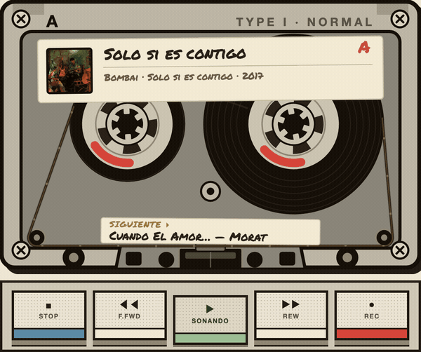
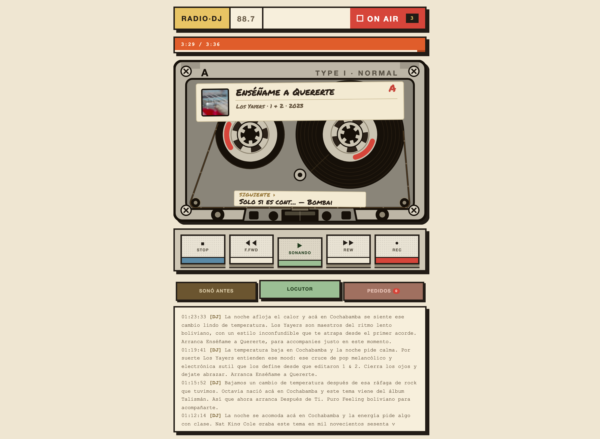
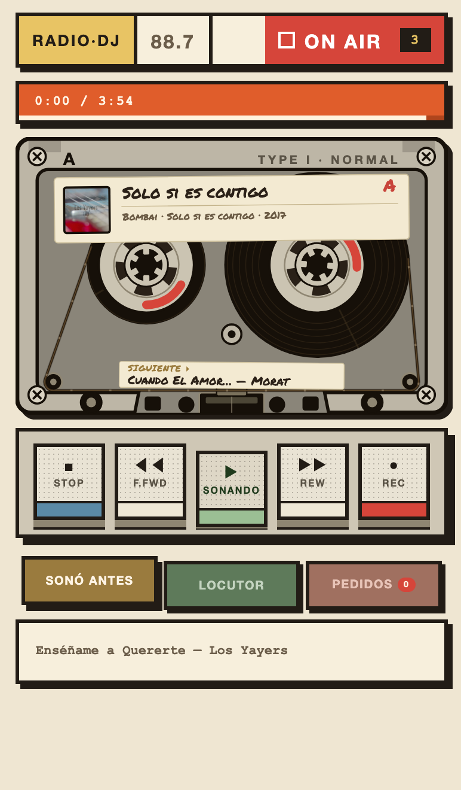
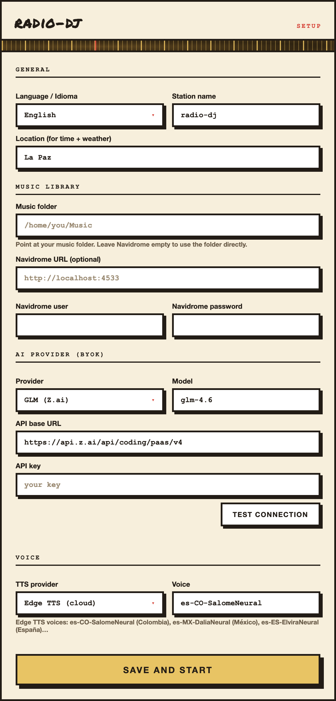

<div align="center">

# radio-dj

**Una radio 24/7 con DJ por IA en un único binario de Go.**
Apuntala tu carpeta de música, poné tu propia key de LLM, y transmite un
stream Icecast MP3 continuo sobre el que el DJ habla — en vivo, en medio
de la canción.

[](LICENSE)
[](https://go.dev)
[]()
[](https://www.linkedin.com/in/johncrash64/)

[Español](README.es.md) · English

</div>

---



`radio-dj` es un único binario de Go (~10 MB) que arma una estación de radio
completa. Elige temas de tu biblioteca, un DJ con IA habla entre canciones —
presenta el artista, lee la hora y el **clima real**, tira **datos curiosos**
con búsqueda web, y agradece los pedidos en vivo — y transmite un stream
Icecast MP3 estándar que cualquier reproductor puede sintonizar.

Sin Docker. Sin pesado. **~20 MB de RAM** (el binario Go; ~50 MB con Icecast + ffmpeg) — corre en una Raspberry Pi.

<br clear="right" />

## ✨ Qué hace

- **Radio 24/7** — un stream Icecast MP3 continuo (192 kbps) que no se corta.
- **DJ con IA** que habla entre canciones — intros, hora, clima real, datos
  curiosos (búsqueda web) y pedidos en vivo. Voz en cualquier idioma.
- **Ducking en vivo** — el DJ puede hablar *sobre* la música
  (`sidechaincompress`), estilo mezcladora hardware.
- **Pedidos en vivo** — los oyentes piden canciones desde la web o la API, con
  un nombre que el DJ lee al aire.
- **UI neo-brutalist** — cassette animado, "ahora suena" + "siguiente", tres
  paneles (historial, log del locutor, pedidos).
- **Skills editables** — reprogramá los segmentos del DJ como archivos de
  texto. Sin recompilar.
- **LLM BYOK** — GLM, OpenAI, OpenRouter, Ollama, Groq, o cualquier proveedor
  compatible con OpenAI.
- **Siempre-on** — se instala como servicio macOS (launchd) o Linux (systemd)
  y sobrevive a reinicios.
- **PWA instalable** — agregá la UI de la radio a tu dock/pantalla de inicio
  (botón de install en Chrome o Safari → Add to Dock). Funciona offline.

---

## 📸 Capturas

| DJ al aire (desktop) | Mobile | Wizard de config |
|:---:|:---:|:---:|
|  |  |  |

---

## 🚀 Instalación rápida

### Una línea (recomendado)

```bash
curl -fsSL https://github.com/johncrash64/radio-dj/raw/master/install.sh | bash
```

Detecta tu OS (macOS o Linux), instala `icecast` + `ffmpeg` + `edge-tts`, y
descarga un binario precompilado (o compila desde fuente si no hay).

### Desde fuente

**macOS (Homebrew):**
```bash
brew install icecast ffmpeg
pipx install edge-tts

git clone https://github.com/johncrash64/radio-dj.git
cd radio-dj && go build -o radio-dj .
```

**Linux (apt):**
```bash
sudo apt-get install icecast2 ffmpeg
pipx install edge-tts            # o: pip3 install --user edge-tts

git clone https://github.com/johncrash64/radio-dj.git
cd radio-dj && go build -o radio-dj .
```

### Configurá y lanzá

Corré `radio-dj serve` — al primer arranque abre un **wizard de onboarding**
que escribe todo a `~/.radio-dj/config.json`. O poné variables de entorno:

> **Reconfigurá cuando quieras:** editá `~/.radio-dj/config.json` y reiniciá,
> o borrá el archivo para revivir el wizard.

```bash
export ZAI_API_KEY=tu_key            # GLM-5.2 (cualquier OpenAI-compatible sirve)
export RDJ_LIBRARY=~/Music/library   # tu carpeta de música
export RDJ_LOCATION="La Paz"         # para la hora y el clima
export RDJ_VOICE_CMD="edge-tts --voice es-CO-SalomeNeural --text {text} --write-media {out}"
```

### Servicio siempre-on (sobrevive reinicios)

```bash
radio-dj install      # macOS → launchd agent · Linux → systemd user unit
radio-dj uninstall    # parar y eliminar el servicio
```

Abrí **http://localhost:7710** (UI) y **http://localhost:7702/stream.mp3** (stream).

### Instalá la app (PWA)

La UI de la radio es una Progressive Web App — instalala para una experiencia
 tipo app nativa:

- **Chrome / Edge** — abrí la UI, hacé clic en el **ícono de install** en la barra.
- **macOS Safari** — **Archivo → Add to Dock**.
- **iOS Safari** — Compartir → **Add to Home Screen**.

Una vez instalada abre en su propia ventana, sin chrome del navegador, y la
shell carga offline (el stream en vivo necesita conexión).

---

## 🎙️ El DJ

El DJ lo maneja un **Director con LLM** que planea cada *tanda* en una sola
llamada estructurada — arma la lista y decide qué decir entre canciones:

- **Intros de temas** — "Ahora suena *Canción* de *Artista*, del disco *Álbum*…"
- **IDs de estación** — nombre, ubicación, cantidad de oyentes.
- **Hora y clima** — reales, según tu ubicación.
- **Datos curiosos** — búsqueda web vía el LLM, o la API gratuita de Wikipedia.
- **Pedidos** — "Esta se la pedió *María* — *pidió que…*"

Cada línea de voz: el **LLM** escribe el texto (con contexto del tema) → **tu
TTS** lo sintetiza → entra al stream antes o durante el tema. Los segmentos
mid-song usan `sidechaincompress` para bajar la música mientras habla el DJ.

---

## 🧩 Skills (editables)

Los segmentos del DJ viven como archivos de texto bajo `~/.radio-dj/skills/`.
Editá los que vienen o agregá los tuyos — radio-dj los carga al arrancar. Sin
recompilar.

---

## 📡 API (para tu app mobile, PanelHUD, Home Assistant, etc.)

HTTP simple — funciona con cualquier cliente:

| Método | Ruta | Descripción |
|---|---|---|
| `GET` | `/now-playing` | tema actual + siguiente + pedidos + estado |
| `POST` | `/request` | `{"from":"María","text":"Bohemian Rhapsody"}` — pedir una canción |
| `GET` | `/stream.mp3` | el stream de audio (Icecast) |
| `GET` | `/listen.pls` / `/listen.m3u` | playlist para Sonos/VLC/auto |
| `GET` | `/health` | liveness |

El stream es una **URL Icecast / HTTP-MP3 estándar** — pegala en VLC, mpv,
cualquier navegador, TuneIn, Radio Garden, Sonos, o apps de radio de
iOS/Android.

Referencia completa: **[docs/API.md](docs/API.md)** · **[docs/openapi.yaml](docs/openapi.yaml)**.

---

## ⚙️ Configuración

radio-dj lee la config de **tres capas, la más baja gana**:

```
env vars (RDJ_*)  >  ~/.radio-dj/config.json  >  defaults
```

**Necesitás solo una.** El wizard de onboarding escribe `config.json` por vos.
Power users / CI pueden pisar todo con env vars.

### Claves de `config.json` (escrito por el wizard, o editable a mano)

```json
{
  "library":       "/home/me/Music/library",
  "source":        "folder",
  "glm_api_key":   "your-key",
  "glm_model":     "glm-5.2",
  "llm_provider":  "glm",
  "voice_provider":"edge-tts",
  "voice":         "es-CO-SalomeNeural",
  "location":      "La Paz",
  "lat":           -16.5,
  "lon":           -68.15,
  "language":      "es",
  "dj_talk":       "regular",
  "chunk":         8,
  "bitrate":       192,
  "station_name":  "radio-dj"
}
```

### Referencia completa (env var → clave config.json → default)

| Env var | clave `config.json` | Default | Qué |
|---|---|---|---|
| `ZAI_API_KEY` / `RDJ_GLM_API_KEY` | `glm_api_key` | — | tu key de LLM (BYOK) |
| `RDJ_LIBRARY` | `library` | `~/Music/library` | carpeta de música |
| `RDJ_SOURCE` | `source` | `folder` | `folder` o `navidrome` |
| `RDJ_NAVIDROME_URL` | `navidrome_url` | `http://localhost:4533` | servidor Navidrome |
| `RDJ_NAVIDROME_USER` | `navidrome_user` | — | usuario Navidrome |
| `RDJ_NAVIDROME_PASS` | `navidrome_pass` | — | password Navidrome |
| `RDJ_GLM_MODEL` | `glm_model` | `glm-5.2` | modelo |
| `RDJ_LLM_PROVIDER` | `llm_provider` | `glm` | preset: `glm`/`openai`/`openrouter`/… |
| `RDJ_VOICE_CMD` | `voice_cmd` | — | comando TTS crudo (`{text}` / `{out}`) |
| `RDJ_VOICE_PROVIDER` | `voice_provider` | — | `edge-tts` / `piper` / `say` |
| `RDJ_VOICE` | `voice` | — | id de voz para el provider |
| `RDJ_LOCATION` | `location` | `La Paz` | ciudad (hora + clima) |
| `RDJ_LAT` / `RDJ_LON` | `lat` / `lon` | coords La Paz | coordenadas precisas para el clima |
| `RDJ_LANGUAGE` | `language` | `es` | `es` o `en` (prompts DJ + UI) |
| `RDJ_DJ_TALK` | `dj_talk` | `regular` | `low`/`regular`/`high`/`verbose` — cuánto habla |
| `RDJ_DJ_EVERY` | `dj_every` | `3` | temas entre talks (piso legacy) |
| `RDJ_CHUNK` | `chunk` | `8` | temas por tanda (ventana de prefetch) |
| `RDJ_BITRATE` | `bitrate` | `192` | bitrate del stream (kbps) |
| `RDJ_STATION_NAME` | `station_name` | `radio-dj` | nombre de la estación |
| `RDJ_BED` | `bed` | — | instrumental para ducking (DJ sobre música) |
| `RDJ_ICECAST_HOST` | — | `localhost` | host de icecast (solo env) |
| `RDJ_ICECAST_PORT` | — | `7702` | puerto de icecast (solo env) |
| `RDJ_ICECAST_SOURCE_PW` | — | — | password source de icecast (solo env) |
| `RDJ_STATUS_PORT` | — | `7710` | puerto web UI + API (solo env) |

> **DJ apagado?** El DJ se queda mudo cuando `glm_api_key` no está o no hay voz
> configurada. La estación igual transmite música sola.

---

## 🛠️ Cómo funciona (arquitectura)

```
radio-dj (Go, ~20 MB RAM)
  ├─ supervisor   levanta y vigila icecast (child process, auto-restart)
  ├─ producer     arma la próxima tanda (Director LLM + TTS) en prefetch
  ├─ master ffmpeg (persistente)   PCM → MP3 → icecast, NUNCA se reconecta
  └─ decoders ffmpeg (por segmento)   tema/voz → PCM al master
```

Una sola conexión a icecast que no se cae = cero cortes para los oyentes.

```
  ┌──────────┐   PCM    ┌──────────────┐  MP3   ┌──────────┐
  │ producer │─────────▶│ master ffmpeg │──────▶│ icecast  │──▶ oyentes
  └──────────┘          └──────────────┘        └──────────┘
       │                        ▲
       │ TTS voz                │ PCM (fd4)
       ▼                        │
  ┌──────────┐          ┌───────────────┐
  │ LLM + TTS │          │ sidechaincomp │  ← baja la música para la voz
  └──────────┘          └───────────────┘
```

---

## 🪶 Licencia

**MIT** — hacé con esto lo que quieras. Ver [LICENSE](LICENSE).

---

<div align="center">

Hecho por **[johncrash64](https://www.linkedin.com/in/johncrash64/)** ·
[Reportar un bug](https://github.com/johncrash64/radio-dj/issues) ·
[Pedir una feature](https://github.com/johncrash64/radio-dj/issues)

</div>
