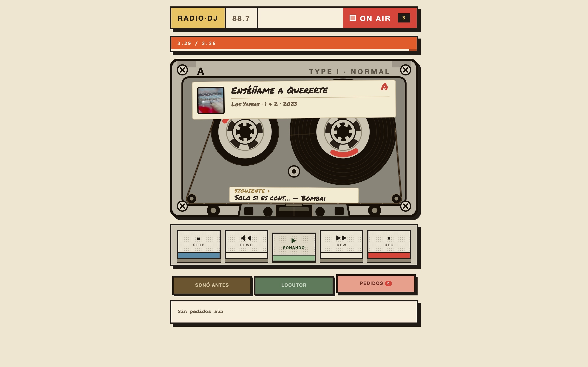

<div align="center">

# radio-dj

**A 24/7 AI-DJ internet radio station in a single Go binary.**
Point it at your music folder, bring your own LLM key, and it broadcasts a
continuous Icecast MP3 stream the DJ talks over — live, mid-song.

[](LICENSE)
[](https://go.dev)
[]()
[](https://www.linkedin.com/in/almanzatech/)

English · [Español](README.es.md)

</div>

---


`radio-dj` is one Go binary (~10 MB) that runs a complete radio station. It
picks tracks from your library, an AI DJ speaks between songs — track intros,
the time, **real weather**, curiosity facts with web search, and live request
shoutouts — and broadcasts a standard Icecast MP3 stream that any player can
tune into.

No Docker. No bloat. **~50 MB of RAM** — runs on a Raspberry Pi.

<br clear="right" />

## ✨ Features

- **24/7 radio** — a continuous Icecast MP3 stream (192 kbps) that doesn't drop.
- **AI DJ** speaking between songs — intros, time, real weather, curiosity
  facts (web search), and live request shoutouts. Voice in any language.
- **Live mid-song ducking** — the DJ can speak *over* the music
  (`sidechaincompress`), hardware-mixer style.
- **Live requests** — listeners request songs from the web UI or the API,
  with a name the DJ reads on air.
- **Neo-brutalist UI** — animated cassette tape, now-playing + next, three
  info panels (history, DJ log, requests).
- **Editable skills** — reprogram the DJ's segments as text files. No
  recompiling.
- **BYOK LLM** — GLM, OpenAI, OpenRouter, Ollama, Groq, or any
  OpenAI-compatible provider.
- **Always-on** — installs as a macOS launchd service, survives reboots.

---

## 📸 Screenshots

| DJ on air (desktop) | Mobile |
|:---:|:---:|
|  |  |

| Live requests |
|:---:|
|  |

---

## 🚀 Quick start (macOS, Apple Silicon)

```bash
# 1. system deps
brew install icecast ffmpeg
pipx install edge-tts          # any TTS that writes a file works

# 2. build
git clone https://github.com/johncrash64/radio-dj.git
cd radio-dj && go build -o radio-dj .

# 3. configure (or skip and use the onboarding wizard at first run)
export ZAI_API_KEY=your_key             # GLM-5.2 (any OpenAI-compatible works)
export RDJ_LIBRARY=~/Music/library      # your music folder
export RDJ_LOCATION="La Paz"            # for time + weather
export RDJ_VOICE_CMD="edge-tts --voice es-CO-SalomeNeural --text {text} --write-media {out}"

# 4. install as an always-on service
./radio-dj install
```

Then open **http://localhost:7710** (UI) and **http://localhost:7702/stream.mp3** (stream).
Uninstall: `./radio-dj install`.

> **One-liner install** (downloads a prebuilt binary or builds from source):
> `curl -fsSL https://github.com/johncrash64/radio-dj/raw/master/install.sh | bash`

---

## 🎙️ The DJ

The DJ is driven by an **LLM Director** that plans each *tanda* (batch) in one
structured call — it picks the setlist and decides what to say between songs:

- **Track intros** — "Up next, *Song* by *Artist* from *Album*…"
- **Station IDs** — name, location, listener count.
- **Time & weather** — real, via your location.
- **Curiosity facts** — web search via the LLM, or the free Wikipedia API.
- **Request shoutouts** — "This one goes out to *María* — *she asked for…*"

Each voice line: **LLM** writes the text (with track context) → **your TTS**
synthesizes it → it airs before or mid-track. Mid-song segments use
`sidechaincompress` to duck the music while the DJ speaks.

---

## 🧩 Skills (editable)

The DJ's segments live as text files under `~/.radio-dj/skills/`. Edit the
built-ins or add your own — radio-dj loads them at startup. No recompiling.

---

## 📡 API

Simple HTTP — works with any client (mobile app, Home Assistant, PanelHUD):

| Method | Path | Description |
|---|---|---|
| `GET` | `/now-playing` | current + next track, requests, status |
| `POST` | `/request` | `{"from":"María","text":"Bohemian Rhapsody"}` — request a song |
| `GET` | `/stream.mp3` | the audio stream (Icecast) |
| `GET` | `/listen.pls` · `/listen.m3u` | playlist for Sonos/VLC/car |
| `GET` | `/health` | liveness |

The stream is a **standard Icecast / HTTP-MP3 URL** — paste it into VLC, mpv,
any browser, TuneIn, Radio Garden, Sonos, or iOS/Android radio apps.

Full reference: **[docs/API.md](docs/API.md)** · **[docs/openapi.yaml](docs/openapi.yaml)**.

---

## ⚙️ Configuration

All `RDJ_*` env vars (or the onboarding wizard's persisted config):

| Variable | Default | What |
|---|---|---|
| `RDJ_LIBRARY` | `~/Music/library` | music folder |
| `RDJ_SOURCE` | `folder` | `folder` or `navidrome` |
| `RDJ_NAVIDROME_URL/USER/PASS` | — | Navidrome source (optional) |
| `ZAI_API_KEY` | — | your LLM key (BYOK) |
| `RDJ_GLM_MODEL` | `glm-5.2` | model name |
| `RDJ_VOICE_CMD` | — | TTS command (`{text}` and `{out}` placeholders) |
| `RDJ_LOCATION` / `RDJ_LAT` / `RDJ_LON` | La Paz | for time + weather |
| `RDJ_DJ_EVERY` | `2` | DJ speaks every N songs |
| `RDJ_CHUNK` | `8` | songs per batch (affects prefetch) |
| `RDJ_BITRATE` | `192` | stream bitrate (kbps) |
| `RDJ_BED` | — | instrumental bed for ducking (DJ over music) |

---

## 🛠️ Architecture

```
radio-dj (Go, ~50 MB RAM)
  ├─ supervisor   spawns + watches icecast (child, auto-restart)
  ├─ producer     builds next batch (LLM Director + TTS) via prefetch
  ├─ master ffmpeg (persistent)   PCM → MP3 → icecast, never reconnects
  └─ decoders ffmpeg (per segment)   track/voice → PCM into the master
```

One icecast connection that never drops = zero listener cutouts.

```
  ┌──────────┐   PCM    ┌──────────────┐  MP3   ┌──────────┐
  │ producer │─────────▶│ master ffmpeg │──────▶│ icecast  │──▶ listeners
  └──────────┘          └──────────────┘        └──────────┘
       │                        ▲
       │ TTS voice              │ PCM (fd4)
       ▼                        │
  ┌──────────┐          ┌───────────────┐
  │ LLM + TTS │          │ sidechaincomp │  ← ducks music for voice
  └──────────┘          └───────────────┘
```

---

## 🪶 License

**MIT** — do whatever you want. See [LICENSE](LICENSE).

---

<div align="center">

Made by **[AlmanzaTech](https://www.linkedin.com/in/almanzatech/)** ·
[Report a bug](https://github.com/johncrash64/radio-dj/issues) ·
[Request a feature](https://github.com/johncrash64/radio-dj/issues)

</div>
